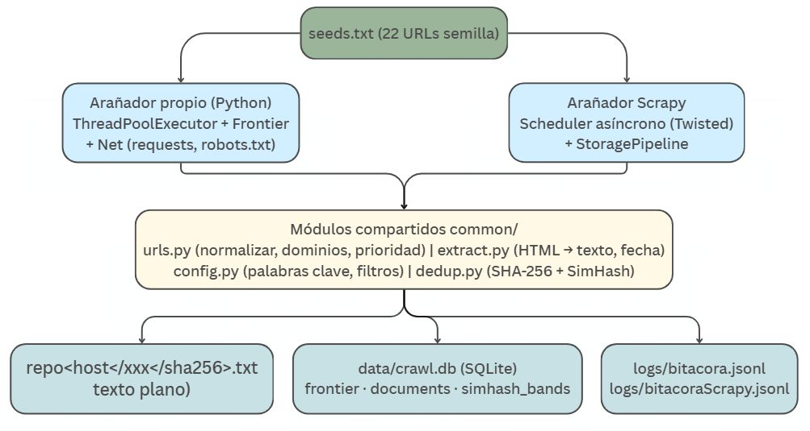

<div align="center">

**Instituto Tecnológico de Costa Rica**

Escuela de Ingeniería en Computación

# ThePremArchive

**Arañadores y repositorio de texto plano sobre la Premier League**


**Proyecto 1 – Arañador**

IC8060 – Recuperación de Información Textual

II Semestre, 2026 · Profesor: Aurelio Sanabria Rodríguez

**Integrantes**

Daniel de Jesús Alemán Ruiz – 2023051957

Sebastián Rodríguez Sánchez – 2023074446

**Fecha de entrega:** 1/10/2026

</div>

---

## Contenido

1. [Introducción](#1-introducción)
2. [Necesidad de información](#2-necesidad-de-información)
3. [Políticas de arañado](#3-políticas-de-arañado)
4. [Implementaciones](#4-implementaciones)
5. [Comparación: arañador propio vs. Scrapy y otras herramientas](#5-comparación-arañador-propio-vs-scrapy-y-otras-herramientas)
6. [Estadísticas del repositorio creado](#6-estadísticas-del-repositorio-creado)
7. [URLs semilla](#7-urls-semilla)
8. [Conclusiones](#8-conclusiones)
9. [Referencias](#referencias)

---

## 1. Introducción

Este documento describe el diseño, la implementación y los resultados de **ThePremArchive**, un sistema de recolección web (web crawling) cuyo propósito es construir un repositorio de al menos 10 GB de texto plano ya procesado sobre la Premier League, la primera división del fútbol profesional inglés. El repositorio servirá como colección base para un buscador textual. El repositorio final alcanzó **15.12 GB de texto limpio en 1,440,556 documentos**.

Para la misma necesidad de información se implementaron dos arañadores: (a) uno **propio**, escrito desde cero en Python con hilos y descarga concurrente, y (b) uno construido con la biblioteca **Scrapy**. Ambos comparten los módulos de políticas y de almacenamiento (`common/`), de forma que la única diferencia real entre ellos es el motor de arañado (hilos y cola propios frente al planificador asíncrono de Scrapy). Esto permite una comparación entre ambas soluciones.

Las decisiones se justifican con la necesidad de información, con el colectivo al que se dirige y con literatura de referencia en recuperación de información y web crawling (Manning, Raghavan y Schütze, 2008; Olston y Najork, 2010; Heydon y Najork, 1999).

### 1.1 Arquitectura general



*Figura 1. Arquitectura: dos motores de arañado sobre módulos de política y almacenamiento compartidos.*

Estructura del repositorio de código:

| Carpeta / archivo | Responsabilidad |
|---|---|
| `common/config.py` | Parámetros, palabras clave del tema, tokens y subdominios descartados, sufijos binarios, user-agent. |
| `common/urls.py` | Normalización de URLs, dominio registrable, filtro de URLs arañables y función de prioridad. |
| `common/extract.py` | Conversión HTML a texto plano, extracción de enlaces y de la fecha de publicación. |
| `common/dedup.py` | Hash exacto (SHA-256) y SimHash de 64 bits con bandas para casi-duplicados. |
| `common/store.py` | SQLite (frontera, documentos, bandas SimHash) y escritura de los `.txt`. |
| `common/bitacora.py` | Bitácora JSONL del recorrido de la araña. |
| `vanilla_spider_premierleague/` | Arañador propio: `crawler.py` (hilos), `frontier.py` (planificador), `net.py` (red, robots.txt), `__main__.py` (CLI). |
| `scrapy_premierleague/` | Arañador Scrapy: spider, pipeline de almacenamiento, extensión de meta de tamaño y settings. |
| `seeds.txt` | Las 22 URLs semilla. |

---

## 2. Necesidad de información

### 2.1 Tema

**Premier League**: la primera división del fútbol profesional inglés, con 20 clubes, y su ecosistema informativo: noticias, resultados, estadísticas, fichajes y análisis.

### 2.2 Características de la información requerida

El buscador necesita documentos de texto en lenguaje natural, principalmente en inglés, publicados en medios y portales especializados. Las categorías de contenido de interés son:

- Noticias y crónicas de partidos.
- Resultados y calendario de partidos (jornadas / matchweeks).
- Tabla de posiciones.
- Estadísticas de jugadores y equipos (goles, asistencias, tarjetas, minutos jugados).
- Fichajes y rumores de transferencias.
- Lesiones y estado físico de los jugadores.
- Entrevistas y declaraciones de jugadores, entrenadores y directivos.
- Historia y perfiles de clubes.

Se descarta explícitamente el contenido no textual (imágenes, audio, video, GIF, CSS, JavaScript, PDF y otros binarios) y el contenido ajeno al tema (otros deportes, otras ligas, política, negocios, tiendas, empleo, etc.).

### 2.3 Tipo de consultas esperadas

Se esperan consultas informativas y de actualidad, mayormente cortas, sobre entidades (clubes, jugadores, entrenadores) y eventos (partidos, fichajes). Ejemplos:

- "Resultado del último partido del Liverpool".
- "Goleadores de la temporada actual".
- "Próximos partidos de la jornada X".
- "Últimos fichajes del Chelsea".
- "Historial de enfrentamientos entre dos equipos".
- "Posición actual del Arsenal en la tabla".

### 2.4 Caracterización del colectivo

| Aspecto | Descripción |
|---|---|
| Rango de edades | Principalmente entre 15 y 45 años. No hay una estadística o encuesta oficial que corrobore la información; sin embargo, el público objetivo principal se ubica entre los 18 y 34 años. Esta selección se fundamenta en datos de YouGov, que indican altos niveles de interés por la Premier League dentro de este grupo etario, alcanzando un 36% de interés declarado entre personas de 18 a 34 años. |
| Contexto socioeconómico | Heterogéneo; audiencia global de aficionados al fútbol, no limitada al Reino Unido. El mercado objetivo no se limita al Reino Unido. De acuerdo con datos de YouGov Global Fan Profiles, la Premier League es una de las competiciones deportivas nacionales con mayor alcance internacional, ya que un 29% de los consumidores analizados en más de 50 mercados alrededor del mundo manifestó interés en la liga. |
| Subtemas de interés | Fantasy football, apuestas deportivas, transferencias, historia y rivalidades entre clubes. |
| Consultas esperadas | Seguimiento en tiempo real de resultados y tablas, comparación de estadísticas de jugadores y noticias del equipo de preferencia del usuario. |

---

## 3. Políticas de arañado

Las políticas siguen la siguiente base: selección de páginas (qué descargar y en qué orden), cortesía (cómo no sobrecargar los sitios), re-visita y paralelización. Se implementaron cinco políticas; la de re-visita no aplica porque el objetivo es construir una colección estática y no mantenerla actualizada. Cada política indica su descripción, justificación, dónde se implementa en el código y los metadatos requeridos.

### 3.1 Resumen: dónde se implementa cada política

| Política | Arañador propio | Arañador Scrapy |
|---|---|---|
| 1. Expansión | `crawler.py::_enqueue_links`, `urls.is_crawlable`, `Frontier.add`, `Store.add_urls` (PK en `frontier.url`) | `spider::_follow_links`, `DEPTH_LIMIT`, `allowed_domains`, filtro de duplicados de Scrapy |
| 2. Recencia | `urls.priority` → columna `frontier.priority`; `Store.claim` (ORDER BY priority) y `Frontier._pick` | `urls.priority` → `scrapy.Request(priority=...)` |
| 3. Relevancia | `config.TOPIC_KEYWORDS/OFF_TOPIC_TOKENS/NOISE_SUBDOMAINS`; `urls.is_crawlable`; `crawler._process` (`min_topic_hits`, `min_text_chars`) | Mismos módulos `common/`; `spider::parse` |
| 4. Cortesía | `net.py` (robots.txt, Crawl-delay, reintentos), `Frontier._pick` (delay y concurrencia por host) | `ROBOTSTXT_OBEY`, `DOWNLOAD_DELAY`, `CONCURRENT_REQUESTS_PER_DOMAIN` (`settings.py`) |
| 5. Deduplicación | `dedup.py`, `Store.is_near_duplicate`, `Store.save` (UNIQUE sha256) | `StoragePipeline.process_item` (misma BD y mismas funciones) |

### 3.2 Política de expansión (frontera de arañado)

**Descripción.** A partir de cada URL semilla se extraen los enlaces internos de los dominios permitidos (el dominio registrable de cada semilla, p. ej. `news.bbc.co.uk` → `bbc.co.uk`) y se agregan a la frontera hasta una profundidad máxima configurable (`max_depth = 6`). Antes de encolarse, cada URL se normaliza (minúsculas en el host, sin fragmento, sin puertos por defecto, sin parámetros de seguimiento como `utm_*` o `fbclid`, sin barras duplicadas) para evitar visitar la misma página con distintas formas de la URL. Se encolan como máximo 300 enlaces por página. Las páginas que no son del tema solo se expanden si están en profundidad ≤ 1 (semillas y su primer nivel), porque funcionan como páginas índice (hubs) cuyo valor está en los enlaces.

**Justificación.** Con 22 semillas no se alcanza el volumen de 10 GB; la información (noticias, estadísticas, perfiles) está repartida en miles de páginas internas de cada sitio, no solo en las portadas. Un recorrido en amplitud limitado por profundidad es la estrategia estándar para descubrir contenido de calidad desde páginas índice (Manning et al., 2008, cap. 20; Olston y Najork, 2010, §3). La normalización evita duplicados de URL, un problema documentado en Heydon y Najork (1999) ("URL-seen test"). Restringir al dominio de las semillas mantiene el arañado enfocado.

**Implementación.** `common/urls.py::normalize`, `registrable_domain`, `is_crawlable`; `vanilla_spider_premierleague/crawler.py::_enqueue_links` y `Frontier.add`; el `PRIMARY KEY` sobre `frontier.url` actúa como filtro de URLs ya vistas (`INSERT OR IGNORE`). En Scrapy: `PremierLeagueSpider._follow_links`, `DEPTH_LIMIT` y `allowed_domains`.

**Metadatos requeridos.** URL de origen (`source_url`), profundidad (`depth`), URL canónica (`url`), `host`, fecha de descubrimiento (`discovered`) y estado (`status`: pendiente, en vuelo, hecho, fallido, omitido) para poder reanudar.

### 3.3 Política de priorización por recencia

**Descripción.** Cada URL recibe un puntaje antes de descargarse y la frontera entrega primero las de mayor puntaje. El puntaje parte de 10, resta 1.5 por nivel de profundidad, suma 3 si el path contiene secciones de actualidad (`/news`, `/report`, `/match`, `/fixture`, `/result`, `/transfer`, `/live`, `/preview`, `/analysis`, `/interview`, `/blog`), suma 3 si el año embebido en la URL es el actual o el anterior (o resta hasta 4 si es más antiguo) y resta 1 si el path es muy profundo (más de 7 segmentos).

**Justificación.** El colectivo espera información actualizada (resultados, fichajes recientes, tabla vigente). Priorizar contenido reciente maximiza la relevancia del repositorio para las consultas esperadas. Olston y Najork (2010) presentan el orden de visita como una política de selección, y Cho, Garcia-Molina y Page (1998) muestran que ordenar la frontera con una métrica de importancia logra mejores colecciones que un recorrido ciego. Como la fecha real solo se conoce después de descargar, se usa una **estimación basada en la URL** (aproximación barata y válida antes de la descarga).

**Implementación.** `common/urls.py::priority`; se guarda en `frontier.priority`; `Store.claim` ordena por prioridad descendente y `Frontier._pick` elige, entre los hosts listos, el de mayor prioridad. En Scrapy se pasa como `priority` de cada `Request`.

**Metadatos requeridos.** Prioridad calculada (`frontier.priority`), profundidad, fecha de publicación (`published_at`, extraída de `article:published_time`, `<time datetime>`, `datePublished` o JSON-LD) y fecha de arañado (`fetched_at`).

**Limitación.** `published_at` no se usa para decidir el orden, solo se guarda; la priorización usa solamente la URL. En la colección final, **1,132,599 documentos (78.6%)** tienen fecha de publicación extraída.

### 3.4 Política de filtrado por relevancia temática

**Descripción.** El filtrado ocurre en dos etapas: (a) **descarte temprano por URL**, sin descargar la página, si el dominio no está permitido, si el subdominio es de servicio (empleos, tienda, viajes, cuentas, ayuda, etc.), si el path termina en una extensión binaria (imágenes, audio, video, PDF, CSS, JS...) o si algún segmento del path contiene un token de otros deportes/ligas o de secciones no editoriales (`rugby`, `cricket`, `nba`, `la-liga`, `politics`, `shop`, `tickets`...); y (b) **filtro por contenido**: tras descargar, un documento solo se conserva si contiene al menos 3 términos distintos (`min_topic_hits`) del vocabulario del dominio (clubes, estadios, jornada, fichaje, penal, etc.) y al menos 500 caracteres de texto limpio (`min_text_chars`).

**Justificación.** Evita contaminar el repositorio con texto fuera de la necesidad de información y evita gastar ancho de banda y tiempo en contenido irrelevante, lo que es crítico en un crawler enfocado (*focused crawler*; Chakrabarti et al., 1999). El filtro de subdominios se agregó tras observar en pruebas reales que dominios permitidos como `theguardian.com` o `espn.com` exponen subdominios ajenos al tema (`holidays.theguardian.com`, `fantasy.espn.com`) que consumían presupuesto de arañado sin aportar contenido relevante. Del mismo modo, las URLs semilla se validaron y ajustaron con base en corridas reales: se descartaron dominios que bloquean el arañado por completo (`robots.txt` restrictivo o bloqueo anti-bot HTTP 403) y se corrigieron rutas semilla que devolvían HTTP 404.

**Implementación.** `common/config.py` (`TOPIC_KEYWORDS`, `OFF_TOPIC_TOKENS`, `NOISE_SUBDOMAINS`, `BINARY_SUFFIXES`), `common/urls.py::is_crawlable`, `common/extract.py::parse` (calcula `topic_hits`) y `crawler.py::_process` (decisión final). El extractor elimina `script`, `style`, `nav`, `header`, `footer`, `aside`, `form`, `button`, `iframe`, `svg` y comentarios, de modo que solo se guarda texto plano. Además, `net.py::fetch` solo acepta respuestas HTML/texto (`text/html`, `application/xhtml`, `text/plain`) y limita el tamaño de página a 4 MB.

**Metadatos requeridos.** `topic_hits` (cantidad de términos del tema detectados), `word_count`, `text_bytes` y el resultado de cada decisión en la bitácora (`off_topic`, `fetch_skipped`, `redirect_out`).

### 3.5 Política de cortesía (crawling ético)

**Descripción.** (1) Se consulta y respeta `robots.txt` de cada origen antes de descargar cualquier página (`urllib.robotparser`); (2) se aplica un retraso mínimo entre solicitudes al mismo host: el mayor entre el configurado (1.5 s por defecto) y el `Crawl-delay` declarado en `robots.txt`; (3) se limita el número de descargas simultáneas por host (2 por defecto); (4) la frontera entrega tareas balanceadas entre hosts, de modo que ningún sitio domina la cola; (5) se usa un User-Agent identificable con contacto (`ThePremArchive/1.0 (+crawler academico IC8060 TEC; contacto: ...)`); (6) se reintenta como máximo 2 veces con retroceso exponencial ante 429/5xx, respetando `Retry-After`.

**Justificación.** Evita sobrecargar servidores de terceros y respeta sus términos de uso. Es una práctica estándar y documentada: el Protocolo de Exclusión de Robots está estandarizado en el RFC 9309 (Koster et al., 2022), y Olston y Najork (2010, §2.3) y Manning et al. (2008, §20.2) señalan la cortesía (retrasos por host y robots.txt) como requisito de todo crawler. La necesidad de repartir carga entre muchos sitios también está alineada con el requisito del curso de no bajar todo de un solo sitio. **Esta política es la principal responsable de que el arañado durara cerca de 168 horas** (ver sección 4.3).

**Implementación.** `vanilla_spider_premierleague/net.py` (`_robots_for`, `allowed`, `crawl_delay`, `Retry`), `vanilla_spider_premierleague/frontier.py` (`_pick` aplica `ready_at` por host y `per_domain_concurrency`), `Store.claim` (lote balanceado por host). En Scrapy: `ROBOTSTXT_OBEY = True`, `DOWNLOAD_DELAY`, `CONCURRENT_REQUESTS_PER_DOMAIN`, `RETRY_TIMES` y `RETRY_HTTP_CODES` en `settings.py`, tomando los mismos valores de `common/config.py`.

**Metadatos requeridos.** Marca de tiempo de cada solicitud (`ts` en la bitácora, `fetched_at` en la BD), código HTTP (`http_status`), tiempo de respuesta (`elapsed_ms`), bytes descargados (`raw_bytes`), resultado (`outcome`: `robots_denied`, `fetch_skipped`, etc.) y delay efectivo por host (en memoria).

### 3.6 Política de deduplicación

**Descripción.** Un mismo partido o noticia se cubre en múltiples fuentes o reaparece en distintas URLs del mismo sitio. Se detectan dos casos: **duplicado exacto**, mediante el SHA-256 del texto normalizado (minúsculas y espacios colapsados), con restricción `UNIQUE` en la BD; y **casi-duplicado**, mediante un SimHash de 64 bits calculado sobre *shingles* de 4 palabras (hasta 4000 por documento). Para buscar candidatos rápidamente, el SimHash se divide en 4 bandas de 16 bits indexadas en la tabla `simhash_bands`; un documento se descarta si algún candidato está a distancia de Hamming ≤ 3.

**Justificación.** Maximiza la diversidad del repositorio y evita inflar artificialmente su tamaño con texto repetido, lo que afectaría también la calidad de las estadísticas y del futuro índice. Los *shingles* para detectar casi-duplicados provienen de Broder et al. (1997) y el SimHash de Charikar (2002); Manku, Jain y Das Sarma (2007) demostraron su eficacia en crawling web con huellas de 64 bits y distancia de Hamming de 3, que son exactamente los parámetros usados aquí. La indexación por bandas aplica el principio del palomar: dos huellas a distancia ≤ 3 comparten al menos una de 4 bandas idénticas.

**Implementación.** `common/dedup.py` (`content_hash`, `simhash`, `bands`, `hamming`), `common/store.py` (`is_near_duplicate`, `save` con `UNIQUE(sha256)`, tabla `simhash_bands`), invocado desde `crawler.py::_process` y desde `pipelines.py::StoragePipeline.process_item`. Como ambos arañadores comparten `data/crawl.db` y `repo/`, la deduplicación opera **entre** implementaciones, y el nombre del archivo es el hash del contenido (`repo/<host>/<2 primeros hex>/<sha256>.txt`).

**Metadatos requeridos.** `sha256`, `simhash` (con signo, porque SQLite almacena enteros de 64 bits con signo), bandas en `simhash_bands` y el evento de descarte en la bitácora (`near_duplicate`, `exact_duplicate`).

### 3.7 Esquema de metadatos almacenados

Los metadatos se guardan en SQLite (`data/crawl.db`). Se eligió SQLite por ser transaccional, no requerir servidor, soportar concurrencia de lectura (modo WAL) y permitir consultas SQL para las estadísticas; las escrituras se serializan con un candado y transacciones `BEGIN IMMEDIATE`.

Además, cada arañador genera una **bitácora** en formato JSONL (una línea por URL procesada, con `ts`, `url`, `depth`, `outcome` y, según el caso, `status`, `ms`, `words`, `bytes`, `topic_hits`, `source`, `published_at`): `logs/bitacora.jsonl` (propio) y `logs/bitacora_scrapy.jsonl` (Scrapy). Los valores posibles de `outcome` son: `stored`, `off_topic`, `near_duplicate`, `exact_duplicate`, `robots_denied`, `fetch_skipped`, `redirect_out`, `error` y `content_type`. Esta bitácora es la evidencia del recorrido de la araña entre distintos sitios.

Ejemplo real de línea de bitácora:

```json
{"ts": 1790023503.735, "url": "https://www.espn.com/soccer/premier-league/", "host": "www.espn.com", "depth": 0, "outcome": "stored", "source": "https://www.espn.com/soccer/league/_/name/eng.1", "words": 585, "bytes": 3507, "published_at": null, "ms": 691}
```

---
## 4. Implementaciones

### 4.1 Arañador propio en Python

Implementado en `vanilla_spider_premierleague/`, sin frameworks de crawling (solo `requests`, `beautifulsoup4`/`lxml` y la biblioteca estándar).

**Concurrencia (hilos y descarga concurrente).** `Crawler.run` crea un `ThreadPoolExecutor` con `workers` hilos (24 por defecto; el README usa 48). Cada hilo ejecuta `_worker`: pide una tarea a la frontera, la procesa (`_process`) y la marca como terminada. Cada hilo mantiene su propia `requests.Session` y su propia conexión SQLite (`threading.local`), por lo que los hilos descargan páginas distintas **al mismo tiempo**. Una excepción en una página no mata al hilo (se registra como `error`). Un hilo monitor imprime cada 5 s los documentos, el tamaño de texto, la velocidad y el tamaño de la cola, y detiene el arañado al alcanzar la meta (`--target-gb`).

**Frontera.** `Frontier` mantiene una cola en memoria por host, respaldada por SQLite. `_refill` reclama de la BD lotes balanceados por host (hasta 200 por host) y los marca *en vuelo*; `_pick` selecciona, entre los hosts que ya cumplieron su retraso y no exceden su límite de concurrencia, el que tiene la tarea de mayor prioridad. Cuando no queda nada pendiente ni activo, la frontera se cierra y los hilos terminan. Si el proceso se interrumpe, `requeue_inflight` devuelve a la cola las URLs que quedaron en vuelo, por lo que el arañado es **reanudable**.

**Uso.**

```bash
python -m vanilla_spider_premierleague crawl --target-gb 10 -w 48 --delay 1 --per-domain 3 -d 6
python -m vanilla_spider_premierleague status   # estadísticas
python -m vanilla_spider_premierleague reset    # reencola URLs en vuelo
```

### 4.2 Arañador con biblioteca existente: Scrapy

Implementado en `scrapy_premierleague/` con Scrapy. Reutiliza `common/` sin cambios; el spider (`PremierLeagueSpider`) solo adapta la lógica a las convenciones de Scrapy: `start_requests` encola las semillas con prioridad; `parse` extrae texto, aplica el filtro de relevancia y genera un `DocumentItem`; `_follow_links` encola los enlaces válidos con `response.follow` y su prioridad; `StoragePipeline` aplica la deduplicación y guarda en el mismo repositorio y BD compartidos; `TargetSizeExtension` imprime el progreso combinado cada 15 s y detiene el spider al llegar a la meta.

Configuración relevante (`settings.py`): `CONCURRENT_REQUESTS = 48`, `CONCURRENT_REQUESTS_PER_DOMAIN`, `DOWNLOAD_DELAY` y `DOWNLOAD_TIMEOUT` tomados de `common/config.py`; `ROBOTSTXT_OBEY = True`; `DEPTH_LIMIT = 6`; `RETRY_TIMES = 2`; reactor asyncio de Twisted.

```bash
cd scrapy_premierleague && scrapy crawl premierleague
```

**¿Funcionó Scrapy?** Sí. Según la bitácora (`logs/bitacora_scrapy.jsonl`), el arañador con Scrapy estuvo registrando actividad durante ≈ 166 horas, procesó 2,198,197 páginas y **almacenó 654,355 documentos (5.83 GB)**, es decir, el 45.4% de los documentos y el 38.6% del tamaño del repositorio final. Solo registró 3 respuestas que no eran texto (`content_type`), además, no se registraron errores en la bitácora; los errores del spider quedarían en scrapy.log

**Limitación de la evidencia.** La bitácora de Scrapy solo registra las páginas que llegaron al método `parse` (almacenadas, fuera de tema, duplicadas o de tipo no textual). Los robots.txt denegados, los errores HTTP (403, 404, etc.) y los reintentos los gestiona internamente Scrapy y no pasan por la bitácora; por eso esos contadores aparecen en 0 en la tabla 4.3 y no deben leerse como "cero fallos". Tampoco se registra el tiempo de descarga por página (`ms`).

### 4.3 Resultados de la ejecución

**Corrida y duración.** Ambos arañadores se ejecutaron **en paralelo sobre las mismas 22 semillas durante ≈ 168 horas (cerca de 7 días)**, escribiendo al mismo repositorio (`repo/`) y a la misma base SQLite (`data/crawl.db`), con deduplicación compartida. El resultado combinado fue un repositorio de **15.12 GB de texto limpio en 1,440,556 documentos**, 51% por encima del mínimo de 10 GB exigido.

**Resultados medidos por arañador** (calculados con `analizar_bitacoras.py` sobre las bitácoras reales):

| Métrica | Propio (hilos) | Scrapy | Total |
|---|---:|---:|---:|
| Páginas registradas en la bitácora | 2,212,919 | 2,198,197 | 4,411,116 |
| Páginas que llegaron al extractor (`parse`)¹ | 1,959,380 | 2,198,194 | 4,157,574 |
| **Documentos almacenados** (`stored`) | **786,157** (54.6%) | **654,355** (45.4%) | 1,440,512 |
| **Texto almacenado** | **9.29 GB** (61.4%) | **5.83 GB** (38.6%) | 15.12 GB |
| Palabras almacenadas | 1,661,125,681 | 1,032,024,310 | 2,693,149,991 |
| Tamaño medio por documento² | ≈ 12.4 KB | ≈ 9.3 KB | ≈ 11 KB |
| Duración (primer a último registro) | 167.9 h | 166.3 h | ≈ 168 h |
| Tiempo con actividad (ventanas de 10 min) | 163.5 h | 158.8 h | – |
| Velocidad de almacenamiento (docs/s, sobre tiempo activo) | 1.34 | 1.14 | ≈ 2.5 |
| Velocidad de análisis² (páginas/s al extractor, sobre tiempo activo) | 3.33 | 3.85 | ≈ 7.2 |
| Tiempo medio de descarga | 1,148 ms | no registrado | – |


**Resultado de cada decisión de las políticas** (cuántas páginas descartó cada una):

| Resultado (`outcome`) | Política | Propio | Scrapy | Total |
|---|---|---:|---:|---:|
| `stored` | – | 786,157 | 654,355 | 1,440,512 |
| `off_topic` | 3 (relevancia) | 532,009 | 648,029 | 1,180,038 |
| `near_duplicate` | 5 (deduplicación) | 600,928 | 804,525 | 1,405,453 |
| `exact_duplicate` | 5 (deduplicación) | 40,286 | 91,285 | 131,571 |
| `robots_denied` | 4 (cortesía) | 39,161 | no registrado | ≥ 39,161 |
| `fetch_skipped` (error HTTP/red) | 4 (cortesía) | 208,442 | no registrado | ≥ 208,442 |
| `redirect_out` | 1 / 3 | 5,873 | – | 5,873 |
| `error` (excepción en el hilo) | – | 63 | – | 63 |
| `content_type` (no era texto) | 3 | – | 3 | 3 |


**Hallazgos de la ejecución.**

1. **Iniciar la descarga con anticipación fue una ventaja decisiva.** Dejar los arañadores corriendo desde temprano permitió descargar mucho más contenido y que el tiempo alcanzara. Las bitácoras muestran que el arañado mantuvo actividad durante ≈ 160 h de las ≈ 168 h; una corrida tardía habría obligado a recortar profundidad, volumen o cortesía.
2. **La duración se explica por las políticas, no por un defecto del motor.** La cortesía (robots.txt, retraso de 1–1.5 s por host, máximo de 2–3 descargas simultáneas por sitio, reintentos con retroceso) acota la velocidad por sitio. Además, solo el **34.6%** de las páginas analizadas termina en el repositorio: el resto se descarta por relevancia (28.4%) y por duplicación (37.0%). Llegar a 15 GB de texto *útil* exigió analizar ≈ 4.16 millones de páginas.
3. **La deduplicación fue la política que más descartó** (1,537,024 páginas: 1,405,453 casi-duplicados y 131,571 duplicados exactos). Un mismo contenido aparece en muchas URLs y secciones de un mismo sitio, y además ambos arañadores recorrían los mismos sitios, de modo que el segundo en llegar a una noticia la descartaba. Esto explica por qué Scrapy tiene una tasa de duplicados mayor (36.6% casi-duplicados y 4.2% exactos, frente a 30.7% y 2.1% del propio): *hipótesis*, no medida directamente.
4. **Cada arañador priorizó sitios distintos.** Aunque partieron de las mismas semillas, el propio almacenó el doble de `dailymail.com` (122,550 frente a 60,796) y es el único que tiene a `caughtoffside.com` entre sus 10 primeros sitios (49,941), mientras Scrapy aportó más de `chroniclelive.co.uk` (49,395) y tiene a `espn.com` entre sus 10 primeros (36,658). La planificación por host del propio (cola por host, elige el host listo con mayor prioridad) y el planificador global de Scrapy reparten el esfuerzo de forma diferente; la causa exacta del reparto no se midió.
5. **La cortesía por host se compensa con concurrencia global y diversidad de sitios.** Como cada sitio solo admite pocas descargas simultáneas, la velocidad total depende de arañar muchos dominios a la vez (22 semillas en 22 dominios distintos).
6. **Muchos sitios bloquean o rechazan al arañador.** En el propio, el 9.4% de las páginas registradas fueron fetch fallidos (208,442) y el 1.8% fueron denegadas por `robots.txt` (39,161). Los códigos 403 (68,393), 405 y 400 sugieren medidas anti-bot en algunos sitios; los errores 404 (30,050) corresponden a enlaces rotos.
7. **Dos arañadores en paralelo sobre un repositorio compartido** aceleraron la recolección y, gracias a la deduplicación común, no duplicaron contenido entre ellos: los totales de la bitácora (15.12 GB, 1,440,512 documentos) coinciden con el repositorio (15.12 GB, 1,440,556).

| Resumen del repositorio final | Valor |
|---|---|
| Duración | ≈ 168 h (bitácoras) |
| Semillas | 22 |
| Documentos almacenados | 1,440,556 |
| Texto almacenado | 15.12 GB |
| Velocidad combinada de almacenamiento | ≈ 2.5 docs/s (1,440,512 / 168 h) |

---

## 5. Comparación: arañador propio vs. Scrapy y otras herramientas

### 5.1 Propio vs. Scrapy

**Diferencias de diseño:**

| Aspecto | Propio (Python + hilos) | Scrapy |
|---|---|---|
| Modelo de concurrencia | Hilos (`ThreadPoolExecutor`) con E/S bloqueante; limitado por el GIL en el procesamiento de HTML, pero la espera de red libera el GIL. | Asíncrono (Twisted/asyncio) con un solo hilo de eventos; escala a muchas conexiones con poco consumo de memoria. |
| Cortesía | Implementada manualmente (robots.txt, Crawl-delay, delay por host). | Configuración declarativa (`ROBOTSTXT_OBEY`, `DOWNLOAD_DELAY`, AutoThrottle). Mucho menos código. |
| Reintentos y errores | `urllib3.Retry` + captura de excepciones en cada hilo; todo queda en la bitácora. | Middleware de reintentos integrado; los errores quedan en `scrapy.log`, no en la bitácora propia. |
| Control fino | Total: políticas de planificación a medida (prioridad entre hosts, límite por host). | Alto mediante middlewares, pipelines y extensiones, pero con las convenciones del framework. |
| Líneas de código | Motor de ≈ 650 líneas (`crawler`, `frontier`, `net`, `__main__`). | Spider + pipeline + extensión + settings ≈ 340 líneas. |
| Curva de aprendizaje | Exige conocer concurrencia, sincronización y HTTP. | Exige aprender el framework; después es más productivo. |

**Diferencias medidas en la corrida** (datos de la sección 4.3):

| Aspecto | Propio | Scrapy | Lectura |
|---|---:|---:|---|
| Documentos almacenados | 786,157 | 654,355 | El propio almacenó 20% más documentos. |
| Texto almacenado | 9.29 GB | 5.83 GB | El propio almacenó 59% más texto (más contenido de `dailymail.com`). |
| Páginas analizadas por segundo | 3.33 | 3.85 | Scrapy analizó ≈ 16% más páginas por segundo. |
| Documentos almacenados por segundo | 1.34 | 1.14 | Pero almacenó menos, porque descartó más como duplicadas. |
| Porcentaje de páginas analizadas que se almacenan | 40.1% | 29.8% | Scrapy tiene más casi-duplicados y exactos. |
| Registro de fallos de red/HTTP | Completo en bitácora | Solo en `scrapy.log` | El propio deja mejor evidencia del recorrido. |

**Interpretación.** El motor asíncrono de Scrapy analizó más páginas por segundo (3.85 frente a 3.33), coherente con que la E/S asíncrona desperdicia menos tiempo esperando respuestas que un hilo bloqueado. Sin embargo, el propio almacenó más documentos y más texto. Esa diferencia **no** se debe a que sea más rápido, sino a que ambos compitieron por las mismas páginas con una deduplicación compartida: cuando los dos llegaban a la misma noticia, el segundo la descartaba. Por eso el número de documentos almacenados depende también del orden de llegada y del reparto de sitios.

**Advertencia metodológica.** No es un benchmark controlado: ambos corrieron al mismo tiempo, sobre la misma máquina y conexión, compartiendo repositorio y deduplicación, por lo que se afectaron mutuamente. Las cifras sirven para comparar el comportamiento en una corrida real, no para afirmar que un motor es X% más rápido que el otro. Además, el propio puede haber usado una cantidad de hilos distinta a la de Scrapy (48) y esa configuración no quedó registrada.

Dado que la lógica de selección, extracción, deduplicación y almacenamiento es **código común**, las diferencias entre ambas corridas se atribuyen al motor de arañado (planificación, concurrencia y manejo de red) y al reparto de sitios.

### 5.2 Otras herramientas (comparación conceptual)

| Herramienta | Características | Cuándo es viable / no viable |
|---|---|---|
| Scrapy | Framework Python asíncrono con middlewares y pipelines. | Viable para crawls de decenas de GB en una máquina y extracción personalizada; no ejecuta JavaScript por sí solo (requiere Splash/Playwright) ni distribuye en clúster sin extensiones adicionales. |
| Propio | Control total, sin dependencias de framework. | Viable para fines académicos y requisitos muy específicos; costoso de mantener y de escalar, con más riesgo de errores de concurrencia. |

### 5.3 Ventajas y desventajas de las políticas

| Política | Ventajas | Desventajas / riesgos | Evidencia en la corrida |
|---|---|---|---|
| 1. Expansión por profundidad | Descubre miles de páginas desde pocas semillas; controla el alcance. | Parte del contenido queda más allá de la profundidad máxima; los hubs de profundidad ≤ 1 se expanden aunque su texto sea pobre. | 22 semillas llevaron a 4.16 millones de páginas analizadas y 1.44 millones de documentos. |
| 2. Recencia (por URL) | Barata (no requiere descargar); favorece noticias y resultados actuales. | Es una estimación; URLs sin año ni sección de noticias reciben puntajes poco informativos. | El 78.6% de los documentos tiene fecha de publicación extraída. |
| 3. Relevancia (palabras clave) | Simple y rápida; excluye otros deportes y subdominios de servicio. | Un umbral fijo de 3 términos puede dejar pasar páginas de otros deportes que mencionan un club, o descartar páginas relevantes con poco texto; el vocabulario está en inglés. | Descartó 1,180,038 páginas (28.4% de las analizadas). |
| 4. Cortesía | Respeta a los sitios; reduce bloqueos. | Reduce la velocidad: con 1–1.5 s por host se limita el rendimiento por sitio y exige muchos sitios y mucho tiempo (≈ 168 h) para alcanzar el volumen. | 39,161 URLs denegadas por `robots.txt` y 68,393 respuestas 403 en el propio; ≈ 7 días de corrida. |
| 5. Deduplicación | Evita repetir texto; SimHash detecta variaciones menores; funciona entre ambos arañadores. | Costo extra por documento (SimHash + consulta a la BD); riesgo de falsos positivos con plantillas muy similares (p. ej. páginas de resultados). | Fue la que más descartó: 1,537,024 páginas (37.0%), más que el filtro de relevancia. |

---

## 6. Estadísticas del repositorio creado

El repositorio final combina lo descargado por ambos arañadores (propio y Scrapy), ejecutados en paralelo sobre las mismas 22 semillas durante aproximadamente 168 horas.

| Métrica | Valor |
|---|---|
| Tamaño total del repositorio (texto limpio) | 15.12 GB |
| Cantidad de documentos | 1,440,556 |
| Cantidad de palabras (ocurrencias totales) | 2,693,195,808 |
| Palabras distintas | 996,383 |
| Documentos con fecha de publicación extraída | 1,132,599 (78.6%) |

### 6.1 Distribución por sitio (top 15)

| Sitio | Documentos | Tamaño |
|---|---:|---:|
| dailymail.com | 183,348 | 9,615.6 MB |
| goal.com | 154,925 | 346.8 MB |
| mirror.co.uk | 139,100 | 668.3 MB |
| liverpoolecho.co.uk | 113,517 | 589.2 MB |
| manchestereveningnews.co.uk | 110,001 | 565.4 MB |
| bbc.com | 103,744 | 916.0 MB |
| birminghammail.co.uk | 88,337 | 424.4 MB |
| transfermarkt.com | 74,398 | 211.7 MB |
| chroniclelive.co.uk | 74,306 | 381.2 MB |
| standard.co.uk | 71,975 | 262.8 MB |
| espn.com | 68,670 | 183.9 MB |
| caughtoffside.com | 55,081 | 135.0 MB |
| teamtalk.com | 43,388 | 189.6 MB |
| independent.co.uk | 41,287 | 227.9 MB |
| theguardian.com | 33,751 | 234.1 MB |

`dailymail.com` concentra más de la mitad del tamaño total del repositorio con solo el 12.7% de los documentos (~54 KB promedio por documento, frente a ~4.8 KB del resto); su plantilla de artículo incluye bastante texto adicional (resúmenes, listas relacionadas) que el extractor conserva por no estar marcado como navegación.

### 6.2 Curva de frecuencia de palabras


La primera gráfica ordena las 996,383 palabras distintas de más a menos frecuente (eje X) contra cuántas veces aparece cada una en todo el repositorio (eje Y), ambos en escala logarítmica. La línea casi recta que se forma es exactamente lo que predice la **ley de Zipf**: en cualquier texto en lenguaje natural, unas pocas palabras (artículos, preposiciones) concentran la mayoría de las apariciones, mientras que la inmensa mayoría de las palabras distintas aparece muy pocas veces (la cola larga de la derecha). Que la curva del repositorio siga este patrón es una buena señal de que el texto extraído es lenguaje natural real y no basura de HTML, menús o código mal limpiado (Manning et al., 2008, cap. 5).


La segunda gráfica muestra las 20 palabras más repetidas. Todas son *stopwords* del inglés (*the*, *to*, *and*, *a*, *in*...), y eso es el resultado esperado, no un error: **a propósito no se filtraron stopwords para esta estadística**, porque la ley de Zipf se demuestra justamente con ellas; son las que arman la curva de la primera gráfica. Quitarlas tendría sentido si esta cifra fuera insumo para un índice de búsqueda o para comparar temas entre documentos, pero no para medir la frecuencia de palabras de la colección completa como pide esta sección. Para la siguiente fase, se tendrán que quitar, por lo que la gráfica cambiará completamente.

---

## 7. URLs semilla

El listado completo de URLs semilla (22, superando el mínimo de 10 pedido), usado como insumo directo por ambos arañadores, se encuentra en [`seeds.txt`](seeds.txt).

Estas URLs son únicamente el punto de partida: el arañador extrae los enlaces internos de cada página visitada (a otras noticias, partidos, perfiles de jugadores, etc.) y los sigue recursivamente según la política de expansión (ver siguiente 3.1), lo que permite alcanzar miles de páginas dentro de los dominios semilla y así llegar al tamaño de repositorio requerido.

Son:
- https://www.caughtoffside.com/category/premier-league/
- https://www.bbc.com/sport/football/premier-league
- https://www.skysports.com/premier-league
- https://www.espn.com/soccer/league/_/name/eng.1
- https://www.theguardian.com/football/premierleague
- https://www.goal.com/en/premier-league/2kwbbcootiqqgmrzs6o5inle5
- https://www.whoscored.com/Regions/252/Tournaments/2/England-Premier-League
- https://www.transfermarkt.com/premier-league/startseite/wettbewerb/GB1
- https://www.fantasyfootballscout.co.uk/
- https://www.teamtalk.com/premier-league
- https://www.mirror.co.uk/sport/football/premier-league/
- https://www.dailymail.com/sport/premierleague/index.html
- https://www.independent.co.uk/sport/football/premier-league
- https://www.standard.co.uk/sport/football
- https://www.football365.com/premier-league
- https://www.planetfootball.com/category/premier-league/
- https://www.footballlondon.co.uk/
- https://www.manchestereveningnews.co.uk/sport/football/
- https://www.liverpoolecho.co.uk/sport/football/
- https://www.chroniclelive.co.uk/sport/football/
- https://www.birminghammail.co.uk/sport/football/
- https://www.givemesport.com/premier-league/
---

## 8. Conclusiones

1. **Se cumplió el requisito con margen.** Se construyó un repositorio de **15.12 GB de texto limpio (1,440,556 documentos, 2,693,195,808 palabras, 996,383 palabras distintas)**, 51% por encima del mínimo de 10 GB, con metadatos en SQLite y una bitácora JSONL por arañador. Los totales de las bitácoras coinciden con los del repositorio (diferencia de 0.003%), lo que valida el registro.
2. **Empezar temprano fue clave.** El arañado ético a gran escala es lento por diseño: tomó ≈ 168 horas (≈ 7 días) de ejecución casi continua. Dejar los arañadores corriendo desde el inicio permitió llegar a la meta a tiempo; no se puede comprimir ese tiempo sin romper la política de cortesía.
3. **La duración y el volumen descargado se explican por las políticas.** La cortesía acota la velocidad por sitio. Además, solo el 34.6% de las 4.16 millones de páginas analizadas terminó en el repositorio: la **deduplicación (37.0%)** y el **filtro de relevancia (28.4%)** descartaron la mayor parte. La deduplicación fue la política con más impacto, lo que confirma que en sitios de noticias un mismo contenido aparece repetido en muchas URLs.
4. **Propio vs. Scrapy.** Ambos funcionaron y aportaron cantidades comparables (786,157 y 654,355 documentos). Scrapy analizó más páginas por segundo (3.85 frente a 3.33), gracias a su modelo asíncrono y con mucho menos código (≈ 340 frente a ≈ 650 líneas); el propio dio control total sobre la planificación por host y dejó una bitácora más completa de fallos y bloqueos. Para una necesidad como esta, en una sola máquina y con políticas a la medida, Scrapy habría sido la opción más productiva; la implementación propia es más valiosa para entender y justificar cada decisión.
5. **Los números de cada arañador no son una prueba de velocidad pura.** Corrieron a la vez, sobre el mismo equipo y con deduplicación compartida, así que se influyeron mutuamente. La diferencia en documentos almacenados refleja también el orden de llegada a las páginas y el reparto de sitios.
6. **Compartir `common/`, SQLite y `repo/` entre ambos arañadores** permitió aislar el efecto del motor de arañado en la comparación y deduplicar entre implementaciones sin un paso de fusión manual.
7. **Calidad del texto y sesgos.** La curva de frecuencias sigue la ley de Zipf y las palabras más frecuentes son *stopwords* del inglés, lo que indica que el extractor produce lenguaje natural y no ruido de HTML. El 78.6% de los documentos tiene fecha de publicación. Sin embargo, `dailymail.com` aporta más de la mitad del tamaño (9.6 GB) con el 12.7% de los documentos, porque su plantilla incluye texto adicional que el extractor no marca como navegación; un extractor por plantilla de sitio reduciría este sesgo.
8. **Limitaciones.** Filtro temático por palabras clave en inglés; recencia estimada por URL (no por la fecha real); no se ejecuta JavaScript (los sitios que cargan contenido dinámicamente pueden aportar poco texto); varios sitios rechazan o bloquean al arañador (68,393 respuestas 403 y 39,161 denegaciones por robots.txt en el propio) y la bitácora de Scrapy no registra esos fallos.

---

## Referencias

- Baeza-Yates, R. y Ribeiro-Neto, B. (2011). *Modern Information Retrieval* (2.ª ed.). Addison-Wesley.
- Broder, A. Z., Glassman, S. C., Manasse, M. S. y Zweig, G. (1997). Syntactic clustering of the Web. *Computer Networks and ISDN Systems, 29*(8–13), 1157–1166.
- Castillo, C. (2004). *Effective Web Crawling* (tesis doctoral). Universidad de Chile.
- Chakrabarti, S., van den Berg, M. y Dom, B. (1999). Focused crawling: a new approach to topic-specific Web resource discovery. *Computer Networks, 31*(11–16), 1623–1640.
- Charikar, M. S. (2002). Similarity estimation techniques from rounding algorithms. En *Proceedings of STOC 2002* (pp. 380–388). ACM.
- Cho, J., Garcia-Molina, H. y Page, L. (1998). Efficient crawling through URL ordering. *Computer Networks and ISDN Systems, 30*(1–7), 161–172.
- Heydon, A. y Najork, M. (1999). Mercator: a scalable, extensible Web crawler. *World Wide Web, 2*(4), 219–229.
- Koster, M., Illyes, G., Zeller, H. y Sassman, L. (2022). *Robots Exclusion Protocol* (RFC 9309). IETF.
- Manku, G. S., Jain, A. y Das Sarma, A. (2007). Detecting near-duplicates for web crawling. En *Proceedings of WWW 2007* (pp. 141–150). ACM.
- Manning, C. D., Raghavan, P. y Schütze, H. (2008). *Introduction to Information Retrieval*. Cambridge University Press. (Caps. 5, 19 y 20; disponible en nlp.stanford.edu/IR-book).
- Olston, C. y Najork, M. (2010). Web crawling. *Foundations and Trends in Information Retrieval, 4*(3), 175–246.
- Scrapy Developers. *Scrapy documentation*. https://docs.scrapy.org
- The Apache Software Foundation. *Apache Nutch documentation*. https://nutch.apache.org
- Ghaffari, Y. *crawler4j*. https://github.com/yasserg/crawler4j
- Dsouza, R. (2023, December 4). *What distinguishes younger Premier League fans from older ones?* YouGov. https://yougov.com/en-gb/articles/48038-what-distinguishes-younger-premier-league-fans-from-older-ones
- Dsouza, R. (2024, January 31). *Mind the gap - Do younger Brits like the same football clubs as older fans?* YouGov. https://yougov.com/en-gb/articles/48512-mind-the-gap-do-younger-brits-like-the-same-football-clubs-as-older-fans
